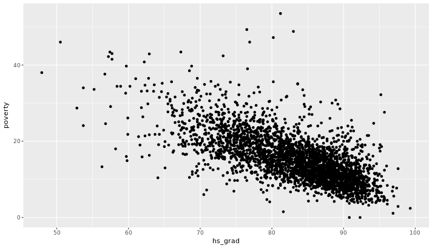
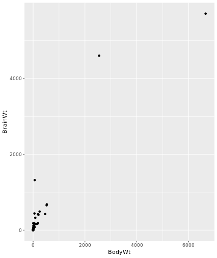
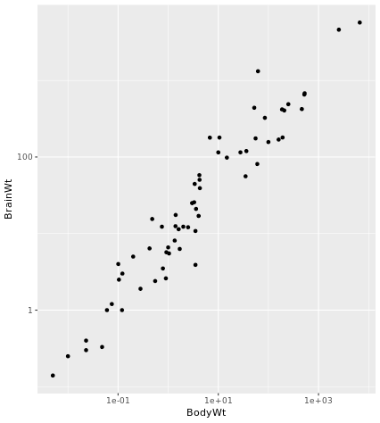
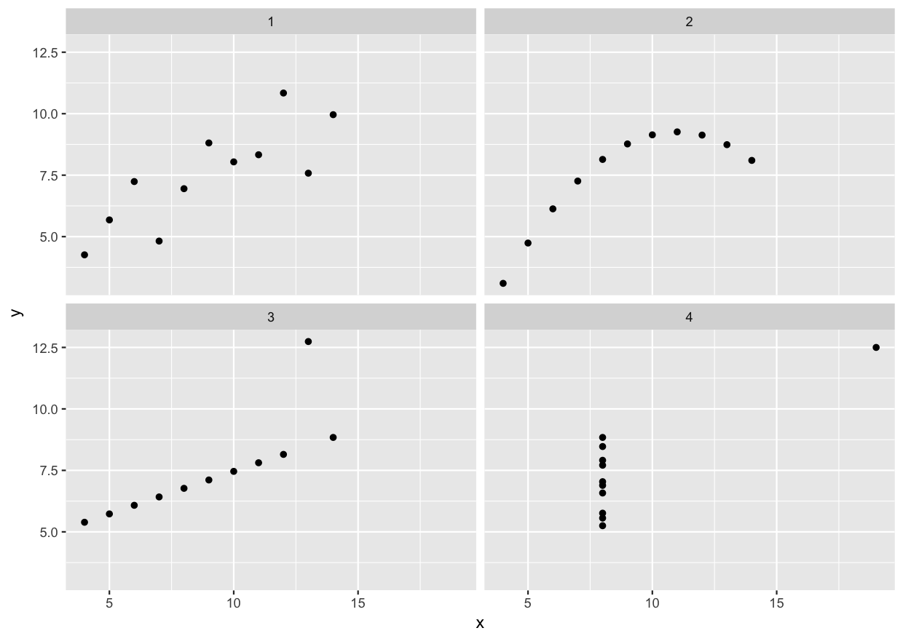

# Correlation and regression
## Chapter 1: Visualizing two variables
This course focus on the relationship between two numerical variables.

**Bivariate analysis** is one of the simplest forms of quantitative (statistical) analysis, It involves the analysis of two variables for the purpose of determining the empirical relationship between them. Bivariate analysis can be helpful in testing simple hypotheses of association. Bivariate analysis can help determine to what extent it becomes easier to know and predict a value for one variable (possible a dependent variable) if we know the value of the other variable (possibly the independent variable).

The **scatter plot** is one of the main and simplest way to visualize a relation between two numerical variables. Code example using the `ggplot()` package:

```R
ggplot(data = possum, aes(y=totalL, x = tailL)) +
    geom_point()+
    scale_x_continuous("some text")+
    scale_y_continuous ("some text")
```
Scatterplots are the most common and effective tools for visualizing the relationship between two numeric variables.

Can think of _boxplots_ as a generalization of a _scatterplot_ but with discretized explanatory variable. This can be achieved in R using the `cut()` function which takes a numerical variable and cuts into descrite chunks. The following is an example creating 5 groups depending on their tails:

```R
ggplot(data=possum, ase(y=totalL,x=cut(tailL, break = 5)))+
    geom_boxplot()
```
The `cut()` function takes two arguments: the continuous variable you want to discretize and the number of `breaks` that you want to make in that continuous variable in order to discretize it.

The patterns and diviation from those patterns that are given to us by these visual representations can give us some insight into the relationship between variables. Specificaly we look for 4 things:

- form (eg.linear, quadratic, non-linear)
- direction (eg. positive, negative)
- strenght
- outliers



This a **linear, negative and moderately string relationship**.

The relationship between two variables may not be linear. In these cases we can sometimes see strange and even inscrutable patterns in a scatterplot of the data. Sometimes there really is no meaningful relationship between the two variables. Other times, a careful transformation of one or both of the variables can reveal a clear relationship.

`ggplot2` provides several different mechanisms for viewing transformed relationships. The `coord_trans()` function transforms the coordinates of the plot. Alternatively, the `scale_x_log10()` and `scale_y_log10()` functions perform a base-10 log transformation of each axis.

```R
# Scatterplot with coord_trans()
ggplot(data = mammals, aes(x = BodyWt, y = BrainWt)) +
  geom_point() + 
  coord_trans(x = "log10", y = "log10")

# Scatterplot with scale_x_log10() and scale_y_log10()
ggplot(data = mammals, aes(x = BodyWt, y = BrainWt)) +
  geom_point() +
  scale_x_log10() + scale_y_log10()

```
Before the transformation:


After the transformation where we can see a linear relation between the log values



## Chapter 2: Correlation
Correlation is a way to quantify the linear relation between 2 variables. The correlation coefficient is a number between -1 and 1 that measures the strenght of a linear relation. The sign corresponds to the direction of the relation.

Correlation coefficients closer to zero means that there is no linear relation. Notice that this only measures linear relationships and not other non-linear forms.

**Pearson product-moment correlation:** 

$$r(x,y) = \frac{Cov(x,y)}{\sqrt{SXX \cdot SYY}}$$

$$r(x,y) = \frac{\sum_{i=1}^n(x_{i}-\overline{x})(y_{i}-\overline{y}))}{\sum_{i=1}^n(x_{i}-\overline{x})^2\cdot\sum_{i=1}^n(y_{i}-\overline{y})^2}$$

The `cor(x, y)` function will compute the Pearson product-moment correlation between variables, `x` and `y`. Since this quantity is symmetric with respect to `x` and `y`, it doesn't matter in which order you put the variables. Setting the `use` argument to "pairwise.complete.obs" allows `cor()` to compute the correlation coefficient for those observations where the values of `x` and `y` are both not missing.

Code example to use summarise

```R
# Compute correlation for all non-missing pairs
ncbirths %>%
  summarize(N = n(), r = cor(weight, weeks, use = "pairwise.complete.obs"))
```

In 1973, Francis Anscombe famously created four datasets with remarkably similar numerical properties, but obviously different graphic relationships. 

Summary for each data set:

```R
# Compute properties of Anscombe
Anscombe %>%
  group_by(set) %>%
  summarize(N = n(), mean(x), sd(x), mean(y), sd(y), cor(x,y))

# A tibble: 4 x 7
  set       N `mean(x)` `sd(x)` `mean(y)` `sd(y)` `cor(x, y)`
  <chr> <int>     <dbl>   <dbl>     <dbl>   <dbl>       <dbl>
1 1        11         9    3.32      7.50    2.03       0.816
2 2        11         9    3.32      7.50    2.03       0.816
3 3        11         9    3.32      7.5     2.03       0.816
4 4        11         9    3.32      7.50    2.03       0.817
```
Nonethless, when ploted we can see that the 4 sets show a very different reality.



**Correlation does not implies causation. Correlation is a simple bivariance statistic and cannot be used fot multivariated regressions.** Just because two variables are evolving in the same directions does not imply that changes in one result from changes in other.

_Statisticians must always be skeptical of potentially spurious correlations. Human beings are very good at seeing patterns in data,sometimes when the patterns themselves are actually just random noise._

## Chapter 3: Simple linear regression