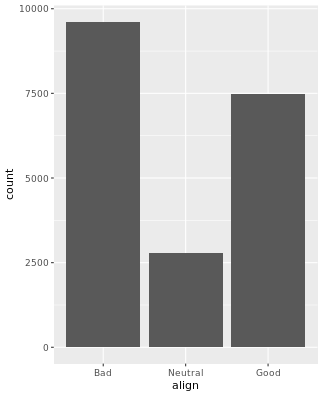
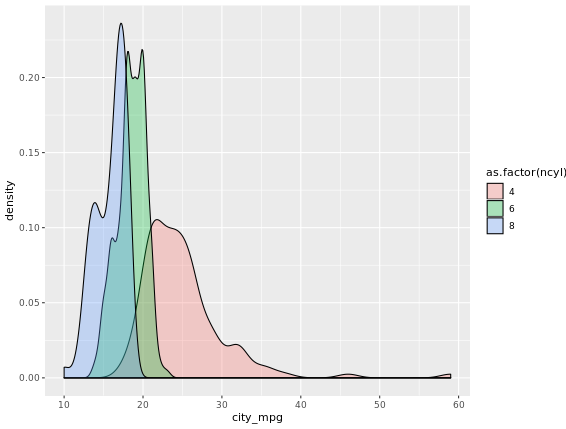
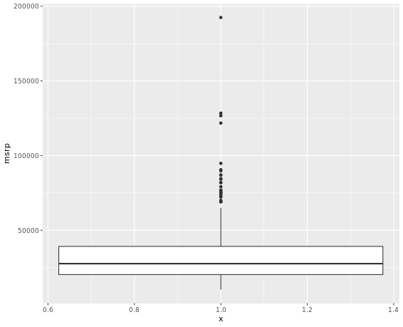

# Exploratory Data Analysis
## Chapter 1: Exploring Categorical Data

In statistics, exploratory data analysis (EDA) is an approach to analyzing data sets to summarize their main characteristics, often with visual methods. A statistical model can be used or not, but primarily EDA is for seeing what the data can tell us beyond the formal modeling or hypothesis testing task. EDA is different from initial data analysis (IDA), which focuses more narrowly on checking assumptions required for model fitting and hypothesis testing, and handling missing values and making transformations of variables as needed. EDA encompasses IDA.

If a data base is tidy and organized, each row should represent a case or observation and each column should be a variable. `Factor` is the preferred class for variables that are categorical. In order to know its levels we use the function `levels()`. 

A common analysis is to cross values from more than one variable by constructing a contingency table. This can be done using the `table()` function. For a more powerful and visual representation a graphic should be used. For this course only the `ggplot` package will be used. The main syntax for a graphic is as follows:

```R
ggplot(data, aes(x = var1, fill = var2)) + layer_name()
```
Code example of bar plot:

```R
# Load ggplot2
library(ggplot2)

# Create side-by-side barchart of gender by alignment
ggplot(comics, aes(x = align, fill = gender)) + 
  geom_bar(position = "dodge")

# Create side-by-side barchart of alignment by gender
ggplot(comics, aes(x = gender, fill = align)) + 
  geom_bar(position = "dodge") +
  theme(axis.text.x = element_text(angle = 90))
```
Passing the argument `position = "dodge"` to `geom_bar()` says that you want a side-by-side barchart.


In R dropping levels requires two steps:  first filtering out any rows with the levels that have very low counts, then removing these levels from the factor variable with `droplevels()`. This is because the `droplevels()` function would keep levels that have just 1 or 2 counts; it only drops levels that don't exist in a dataset. The following code is an example of droplevels with filter:

```R
# Load dplyr
library(dplyr)

# Print tab
print(tab)

# Remove align level
comics_filtered <- comics %>%
  filter(align != "Reformed Criminals") %>%
  droplevels()

# See the result
comics_filtered
```

Notice that `filter()` is used to select all rows which "align" is different of "Reformed Criminals".

Most times proportion give more relevant information than raw counts. In order to generate a proportion table we can use the following code:

```R
tab_cnt <- table(comics$id, comics$align)
prop.table(tab_cnt)
```
The function `prop.table()` generates a proportion table. We can condition the proportions by including 1 if we want to condition on the row (every row sums 1 now) or 2 for columns.

For conditional proportion visual representation we need to add an argument `position = "fill"` to the `geom_bar()` argument on ggplot. With this code all columns will now sum 1.

```R
ggplot(comics, aes(x = id, fill = align))+ 
    geom_bar(position = "fill") + 
    ylab("proportion")
```
By adding the `position = "fill"` to `geom_bar` we are saying we want the bars to fill the entire height of the plotting window, thus displaying proportions and not raw counts.

If we provide the `table()` function with a single vector, meaning with a single variable, it will show the count of each level.

The syntax to create a simple barchar in this case in very straight forward:

```R
ggplot(comics, aes(x=id)) + geom_bar()
```
Faceting brakes the data in subsets based on the levels of a categorical variable and constructs a plot for each. In ggplot we can easily do this by adding the argument `fact_wrap(~<condition by>)`

Example:
```R
ggplot(comics, aes(x = id)) +
    geom_bar() +
    facet_wrap(~align)
```

Code example with a code line to reorder levels before plotting:

```R
# Change the order of the levels in align
comics$align <- factor(comics$align, 
                       levels = c("Bad", "Neutral", "Good"))

# Create plot of align
ggplot(comics, aes(x = align)) + 
  geom_bar()
```


## Chapter 2: Exploring Numerical Data
Numerical data is data that takes the form of numbers. The `str()` function (already used on other courses) provide us with an overview of the data. (the `gplimpse()` function can be used to).

In order to start analyzing data visually is commonly to start with a simple `Dotplot`:
or a `Histogram`. The difference is that the latest bins observations to represent on the x axis while the first stack them up.

```R
# Dotplot
ggplot(data, aes(x=weight)) + 
    geom_dotplot(dotsize=0.4)

# Histogram
ggplot(data, aes(x = weight) + 
    geom_histogram()
```

For a more abstract sense of the distribution we can identify the centre of the distribution, plus the values that mark off the vast majority of the data. This values can be used to construct a `boxplot`. In this case, extreme values are represented as points.

```R
ggplot(data, aes(x=1,y=weight))+
    geom_boxplot()+
    coord_flip()
```

Many times a density plot would come in handy to have a better representation. The following code filters the cars dataset by car with 4,6,8 cylinders. Note that we have used `%in%` instead of `==` in order to say "it belongs to".

```R
# Filter cars with 4, 6, 8 cylinders
common_cyl <- filter(cars, cars$ncyl %in% c(4,6,8))

# Create box plots of city mpg by ncyl
ggplot(common_cyl, aes(x = as.factor(ncyl), y = city_mpg)) +
  geom_boxplot()

# Create overlaid density plots for same data
ggplot(common_cyl, aes(x = city_mpg, fill = as.factor(ncyl))) +
  geom_density(alpha = .3)
```


There are 2 main ways of getting the distribution of only one variable:

1. Marginal vs. conditional
2. Building a data pipeline

```R
cars2 <- cars %>%
        filter(eng_size < 2.0)

ggplot(cars2, aes(x= hwy_mpg)) + 
    geom_histogram()

# Or we can pipe both
cars %>%
    filter(eng_size < 2.0) %>%
    ggplot(aes(x=hwy_mpg)) +
    geom_histogram()
```
If we introduce ann argument "binwidth = number" on geom_histogram we will override ggplot bins. The binwidth determines how smooth your distribution will appear: the smaller the binwidth, the more jagged your distribution becomes. It's good practice to consider several binwidths in order to detect different types of structure in your data.

<span style = color:blue> **Hint:**on a ggplot you can add a title by adding the argument `ggtitle()`. </span>

The box plot is based around 3 basic statistics:
1. the first quartile of the data (edge of the box)
2. the second quartile of the data or the median (middle of the box)
3. the third quartile of the data (edge of the box)

The line that starts from both edges of the box should, in theory include 100% of the data. In R, using the `ggplot` package, outlier values outside of this line are represented as dots. One of the weaknesses of box plot is that there is no way we can identify a distribution with more than one mode.

The following code constructs a box plot for one variable. Notice that we used the argument `x = 1` to set only one box plot:

```R
cars %>%
  ggplot(aes(x = 1, y = msrp)) +
  geom_boxplot()
```



When we start analyzing for more than 2 variables we start working with 3D plots. One way is to use a `facet_grid`.

Code example:
```R
ggplot(cars,aes(x=msrp))+
    geom_density()+
    facet_grid (pickup ~ rear_wheel, labeller = label_both)
```
Whatever variable goes before `~` will go for the rows of the grid and after to the columns. Faceting is a valuable technique for looking at several conditional distributions at the same time. If the faceted distributions are laid out in a grid, you can consider the association between a variable and two others, one on the rows of the grid and the other on the columns.

Density plots normalize so that they take the same are, resulting in difficulty in distinguish between two different population sizes.

## Chapter 3: Numerical Summaries
`Median` is the middle value on a sorted dataset which is different from the `mean`. The `mode` is the most common observation on a set.

In order to compare values on a dataset we can use groupwise means. The following code gives an example of how to set it:

```R
life <- life %>%
    mutate(west_coast = state %in% c("California", "Oregon", "Washington"))

life %>%
    group_by(west_coast) %>%
    summarize(mean(expectancy),
            median (expectancy))
```
The first line of code creates a binary variable that is either TRUE if the value on each row of the variable `state` belongs to the given vector and FALSE otherwise. This new variable is then used calculate mean and median by group using the `group_by()` function.

The sample `variance` measures the distance between a each observation and a center of the dataset (in this case the **mean**). The code `summ((x-mean(x))^2)/(n-1)` gives a measure of variance. This can be calculated using the function `var()`.

The square root of this number, the variation, is the standard deviation `sd()`. When computed, standard deviation is on the same units as the original data.

The _**Interquartile range**_ is the difference between the 1st and the 3rd quartile and can be directly calculated by using the function `IQR()`. The function `diff(range(x))` gives us the difference between the _min_ and _max_ of a dataset.

<span style = color:red> Attention: mean and standard deviation are highly influenced by outliers and should be used with care on skewed datasets. </span>

**Shape:**

We have talked about the center and distribution of a dataset, but now we look into the shape of any distribution which are described in _modality_ and _askew_.

The modality of a distribution is the number of prominent humps that show up on a distribution. This could be _unimodal_, _bimodal_ or _multimodal_. An _uniform_ distribution is flat across all values.

**Outliers**
This are observations that have extreme values far from the bulk of the population.
