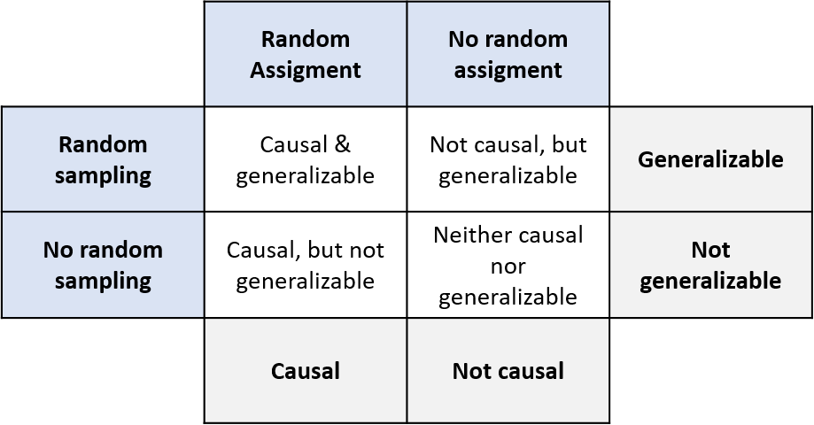

# Introduction to data
## Chapter 1 - Language of data
On a dataframe the information is organized so that each line/row represents an observation and each column a variable.

Code example to load a package and data from inside the package:

```R
#Load package
library (openintro)

#Load data
data(hsb2)
```
The `str()` function provides the structure of the data we are going to use. Alternatively, one can use the `dplyr::glimpse()` function. Both cases return the total number of variables and observation, the name of each variable and allow to check the first values.

**Types of variables:**
* Numerical (quantitative): numerical values
    - **Continuous**: infinite number of values within a given range, often measured
    - **Discrete**: specific set of numeric values that can be counted or enumerated, often counted

* Categorical (qualitative): limited number of distinct categories. [Not good to make arithmetic calculations]
    - **Ordinal**: finite number of values within a given range, often measured [often they are treated as _factors_]

<span style =color:blue>**Categorical data is often stored as factors in R.** Important use: statistical modeling.</span>

Categorical variables are useful especially when we need to subset our data or only gather information filtered by a specific characteristic. For that we can use `table()` function in R. The following code example shows how quickly we can access data using this function:

```R
# Number of students in public and private schools in hsb2
table(hsb2$schtyp)

public  private
168     32

# Filters the database to only public
hsb2_public <- hsb2 %>%
    filter (schtyp == "public")
    
```
The pipe operator tells R to pass the object that comes before the operator (right side)to the function that comes after. Pipes are useful because they allow us to create sequences of data wrangling.

> From wikipedia: Data wrangling, sometimes referred to as data munging, is the process of transforming and mapping data from one "raw" data form into another format with the intent of making it more appropriate and valuable for a variety of downstream purposes such as analytics. A data wrangler is a person who performs these transformation operations.

When subsetting a data frame using factors (for example removing one of the levels) R will always leave the level as a placeholder on the data frame. This can be a problem during data visualization and therefore is advisable that this unused levels be removed. Levels can be dropped using the `droplevels()` function to overwrite the factor column. 

```R
hsb2_public$schtyp <- droplevels(hsb2_public$schtyp)
```

A common way of creating a new variable from an existing variable is discretizing, that is, converting a numerical variable to a categorical variable based on certain criteria.

> **Tip:** sometimes is useful to assign a function result to a new variable but to print the result to. To avoid the redundancy of repeating code, we can use brackets around the entire expression like: `(avg_read <- mean(hsb2$read))`

Example of using the dplyr package to create a variable on a data frame conditional to a function:

```R
# Creat a new variable: read_cat
hsb2 <- hsb2 %>%
        mutate(read_cat = ifelse(read <avg_read,
            "below average","at or above average"))
```

>The median marks the 50th percentile, or midpoint, of a distribution.

`dplyr::case_when()` function allows you to vectorise multiple `if` and `else if` statements. A sequence of two-sided formulas. The left hand side (LHS) determines which values match this case. The right hand side (RHS) provides the replacement value. The LHS must evaluate to a logical vector. The RHS does need to be logical, but all RHSs must evaluate to the same type of vector. Example of code using `dplyr::case_when()`

```R
email50_fortified <- email50 %>%
  mutate(number_yn = case_when(
    email50$number == "none" ~ "no", 
    # if number is "none", make number_yn "no"
    email50$number != "none" ~ "yes"  
    # if number is not "none", make number_yn "yes"
    )
  )
```
This code is useful to create a series of conditions over a given variable and more readable than a chain of `ifelse`.

#### Visualizing numerical data
The first step of any data analysis is an exploratory analysis is an exploratory analysis, and for this purpose, visualizing data is one of the best tools.

This course uses the ggplot2. Here is an example of a plot:

```R
#Scatterplot of math vs. science scores
ggplot(data = hsb2, aes(x = science, y = math)) + geom_point()
```
The first argument is the data frame containing the data we wish to plot. `aes` stands for the aesthetics of the plot where we say that we want the axis to be. `geom_point` represents the way we render each observation. In this case we decided we wanted it to be rendered as a point. ggplot2 plots are constructed iteratively from a series of layers, the plus sign separates this layers. [note: when we want to use a multivariable analysis we can assign variables to colors on the `aes`. Sometimes is useful to force ggplot2 to accept this variables as factors even if they are not defined as such. For this we define color parameter as follows: `color = factor(spam)`].

## Chapter 2 - Study types and cautionary tales
### Observational studies and experiments

**Observational study:** researchers collect data in a way that does not directly interfere with how the data arise. Based on an observational study we can only establish an association between the explanatory and response variables (only correlation can be inferred).

**Experiment:** researchers randomly assign subjects to various treatments and can therefore establish causal connections between the explanatory and response variables(causation can be inferred).

### Random sampling and random assignment
**Random sampling** occurs when subjects are being selected for a study.If subjects are selected randomly from the population, **then the resulting sample is likely representative of the population**. It Helps generalizability of results.

**Random assignment** occurs only in experimental settings where subjects are being assigned to various treatments. It helps infer causation from results.



Truly understanding the relationship between two variables might require considering other potentially related variables as well. _[please refer to covarite in Statistical modeling in R (part 1)]_

Simpson's paradox: illustrates the effect the omission of an explanatory variable can have on the measure of association between another explanatory variable and the response variable. In other words, the inclusion of a third variable in the analysis can change the apparent relationship between the other two variables.

`dplyr::count()` groups the data and then tallies the number of observations in each level of the grouping variable.The following code example uses `count()` on a database to count the number of observations of combinations between two columns/variables. Passing several arguments to `count()` gives the number of rows for each combination of those arguments.

The count syntax is `count(dataframe, variables, ...)` but in this case pipes were used for simplification:

```R
# Database structure
glimpse(ucb_admit)

Observations: 4,526
Variables: 3
$ Admit  <fct> Admitted, Admitted, Admitted, Admitted, Admitted, Admitted, ...
$ Gender <fct> Male, Male, Male, Male, Male, Male, Male, Male, Male, Male, ...
$ Dept   <chr> "A", "A", "A", "A", "A", "A", "A", "A", "A", "A", "A", "A", ...

# Code
ucb_admit %>% 
    dplyr::count(Gender, Admit)

# A tibble: 4 x 3
  Gender Admit        n
  <fct>  <fct>    <int>
1 Male   Admitted  1198
2 Male   Rejected  1493
3 Female Admitted   557
4 Female Rejected  1278
```
Given the previous code results (as ucb_admission_counts) the following code calculates the proportion of each condition. 

```R
ucb_admission_counts %>%
  # Group by gender
  group_by(Gender) %>%
  # Create new variable
  mutate(prop = n / sum(n)) %>%
  # Filter for admitted
  subset(Admit == "Admitted")

# Results:

  # A tibble: 2 x 4
  # Groups:   Gender [2]
  Gender Admit        n  prop
  <fct>  <fct>    <int> <dbl>
1 Male   Admitted  1198 0.445
2 Female Admitted   557 0.304
```

:heavy_exclamation_mark: It starts by using `gather_by`. If the code/pipe was executed only with this two lines the outcome wouldn't differ from the previous code.Nonetheless, <span style = color:blue> what R is doing on the background is creating 2 groups based on gender. This line of code is what allows for the new variable `prop` to give us the proportion for admitted and non admitted for each subgroup of male and female.  </span>   **If the `gather()` wasn't used, the result for prop would be the proportion of each 4 observation over the total observation.** The subset function on the end filters the observations to only showcase "Admitted". 

From the exercises we learned that overall, males are more likely to be admitted. Nonetheless, when we expand our analysis to include department we learn that in fact, within most departments, female are actually more likely to be hired. This is an example of simpson's paradox.

Examples as this highlights the importance of good study design.

## Chapter 3 - Sampling strategies and experimental design
### Sampling strategies
For your inference to be valid, your sample needs to be representative of the entire population. There are a few technics to create a sample:

1. <span style = color:blue> **Simple random sample**</span>: In simple random sampling, we randomly select cases from the population such that each case is equally likely to be selected. 
   
2. <span style = color:blue>**Stratified sampling**</span>: we first divide the population into homogeneous groups, called strata. and then we randomly sample from within each stratum.

3. <span style = color:blue>**Cluster sampling**</span>: we divide the population into clusters randomly, sample a few clusters, and them sample all observations within these clusters. Unlike strata, clusters are heterogeneous within themselves and each cluster is similar to the others, such that we can get away with sampling from just a few of the clusters.
   
4. <span style = color:blue>**Multistage sampling**</span>: adds another step to cluster sampling by randomly sampling observations from within those clusters.

In order to generate a random sample in R we can use `dplyer::sample_n("database","number of samples")`. If we are looking to use a stratified sample we first have to group the population and them run the sample. Example code:

```R
# Using counties population database
# Simple random sample of 150 counties
county_srs <- county_noDC %>%
    sample_n(size = 150)

# If we want to have the same number of counties from each state
# a simple random sample won't work. We should use stratified sample
county <- county_noDC %>%
    group_by(state) %>%
    sample_n(size = 3)
```
### Principles of experimental design
**Control:** compare treatment of interest to a control group;
**Randomize:** randomly assign subjects to treatments;
**Replicate:** collect a sufficiently large sample within a study, or replicate the entire study;
**Block:** account for the potential effect of known or suspected confounding confounding variables. To achieve this we first group subjects into blocks and then randomizing them within each block to treatment groups.