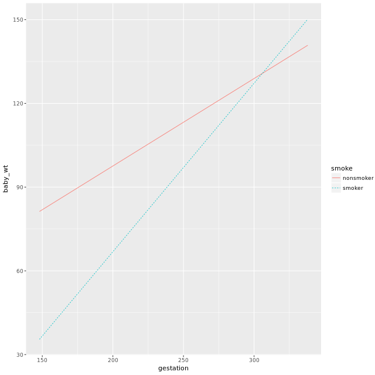

# Statistical Modeling in R (part 2)
## Chapter 1 - Effect size and interaction

To evaluate the model, need to set values for explanatory variables (commonly use mean, median, or mode).
To visualize the model, need to select several different levels of explanatory variables to include.

To streamline the process the `statisticalModeling` package provides 2 different functions:

1. `effect_size(model, formula, ...)` it calculates an effect size by scanning the data and finding appropriated values for the explanatory variable.
   
2. `fmodel(model,formula,data,type,...)` it lets you plot your model. The formula goes like this ~ x_var + color_var + plot_var. Response variable always on the y-axis. If the response is categorical it will plot the probability of the first category.

### Categorical responses variables
For a _quantitative response variable_ and a:
  - Quantitative explanatory variable, _effect size is a rate_
  - Categorical explanatory variable, _effect size is a difference_

But how to do in the case of a **Categorical response variable?**. There are 2 ways to frame the output:
1. As categories or classes
2. As probabilities

Changes on categorical variables are binary. It is one or nothing (this is relevant when it comes to credit risk analysis). This models are seen in "groups" and therefore we can calculate the probability for each individual to be part of that group.

After creating a model when can use, once again, `evaluate_model()` to calculate the probability for each class or to predict which class for each observation. The following code exemplifies:

```R
model_1 <- rpart(start_position ~ age + sex + nruns, 
                 data = Runners, cp = 0.001)

as_class <- evaluate_model(model_1, type = "class")
as_prob  <- evaluate_model(model_1)
```
On the `as_class` the category for each observation is the category with the highest probability.

> **Quote:** When the response variable is categorical, effect sizes are calculated using the probability of each possible output class. Since an effect size compares the model outputs for two different levels of the explanatory variables, each effect size is a difference in probability. Positive numbers mean that the probability increases from the base level to the to: level; negative numbers mean the the probability decreases.

There's a very important special case for classification: when the response variable has only two levels. Of course, you can use the recursive partitioning architecture, but **it's much more common in the two-level situation to use a technique known as logistic regression.**

> **Note from exercise** _Common sense suggests that survival changes continuously with age. **Recursive partitioning works best for sharp, discontinuous changes. Logistic regression can capture smooth changes**, and works better here._

### Interaction among explanatory variables
Effect size of one variable may change with to other explanatory variables. This is called and Interaction effect.

Interaction and model architecture:
- `lm()` includes interaction only if you ask for them. In order to ask for this interaction you change the formula when training the model. Instead of including explanatory variables using the + sign, we use * to represent interactions.
- `rpart()` has interactions built into the method

The inclusion of interaction can hurt or enhance a model. Therefore is must be tested. Code example:

```R
mod2: ~ year + sex
mod2: ~ year * sex

t.test(mse ~model, data = cv_pred_error(mod2,mod3))
```

In the linear model architecture, you specify an interaction between two explanatory variables by using `*` notation rather than `+`.

> Recall that an interaction describes how one explanatory variable (e.g. smoke) changes the effect size of the other (e.g. gestation).



> **Notes about the graph:** The following statements are true
> - The effect size of gestation is the slope of the model graph.
> - The effect size of smoke is the vertical offset from the smoker to the nonsmoker line.
> - No interaction between gestation and smoke could ever be seen in this (slightly different) model: baby_wt ~ gestation + smoke
> - The interaction between gestation and smoke can be seen in the difference in slopes between the smoker and nonsmoker lines. This is how smoke modulates the effect size of gestation.
> - The interaction between gestation and smoke can be seen in the changing vertical offset between the smoker and nonsmoker lines. This is how gestation modulates the effect size of smoke.

The t-test is a technique for comparing two sets of numbers. Here, the numbers are the cross validation prediction errors from the several trials.

### Total and partial change
The effect size quantifies the strength of a relationship between 2 variables.

```
Input x = 7 <-> Model M <-> Response Y = 3.2
Input x = 8 <-> Model M <-> Response Y = 3.5
```
`(3.5+3.2)/(8-7) = 0,3`

Being positive means that the response increases as the explanatory variable increases (it has a positive relation).

The magnitude of this relation depends, a lot, on the units used. If we want to compare we will have to convert them into the same units. example:

`-0.055 dollars / mile *  10000 miles / year = -550 dollars/year`

When there are multiple inputs is easy to change them independently inside a model, nonetheless, in real life changing one variable often means changing other variables too because they are connected. 

### Total vs. partial change
**Partial change**: impact on the response of changing one input _holding all other inputs constant_

**Total change**: impact on the response of changing one input letting the _others change as they will_

Implication for model building:
- Partial change: includes all covariates that you want to hold constant while varying the explanatory variable
- Total change: exclude all covariates that you want to allow to change along the explanatory variable.

Note: this affects on the calculation of the formula for the function effect_size.

### R-squared
Correlation: r ("little r")
Coefficient of determination: R2 -> It can only be used for models with a quantitative variables.

R-squared gives the fraction of the variance in the response variable accounted for by the model. Bigger is not always better. R-squared is about prediction, but that's not always the goal

The R-squared of a model evaluated on input data is the variance of the model output divided by the variance of the response variable in the input data. 

In order to calculate the R-squared one can use the following code 

```R
output_1 <- evaluate_model(model_1, data = HDD_Minneapolis)
with(output_1, var(model_output)/var(hdd))
```

`var()` computes the variance of a variable. Recall that R-squared is the variance in the model output divided by the variance in the actual response values. **It is almost always calculated on the training data**.

R-squared can be difficult to use to compare different models. R-squared goes up as new explanatory variables are added, _even if those explanatory variables are meaningless_.

As an alternative we can use `rsquared()` for calculations.

### Degrees of freedom
Analysis of variance (ANOVA)
`anova(mod4)` between other information it gives us the p-values for each variables on our models. Small p-values means higher predictability for the variable.

> **Notes from the example given:** The city variable has 33 degrees of freedom and with the inclusion of so many variables what the model actually does is diving into more subgroups our data. Given that the population of restaurants is small is no wonder that the R-squared goes up given that the variance for each group is small.

**Rules for counting degrees of freedom**
- A dataset with **n** cases has **n** degrees of freedom.
- The explanatory side of a model formula has a number of degrees of freedom that depends on the terms in the formula. Start counting at 1; every model has at least 1 degree of freedom even if there are no explanatory variables.
  - A single variable has 1 degree of freedom if it is quantitative. If it is categorical with k different levels, it has k−1 degrees of freedom.
  -If variables are connected with +, add together their individual degrees of freedom.
  -If variables are connected with *, add together their individual degrees of freedom and then add in the product of their individual degrees of freedom.
  -There are special rules that apply in some special circumstances, but you don't need to worry about those here.
- The difference between the degrees of freedom of the dataset and the degrees of freedom of the model formula is called the residual degrees of freedom. Models with zero residual degrees of freedom are not generally at all useful. Models with a handful of residual degrees of freedom have statistical properties that are not reliable.

It often happens that you'll include extra degrees of freedom in a model by accident, so watch out. One way that this might occur is when a variable that's intended to be quantitative is instead treated as categorical (perhaps because there's a non-numeric entry for a categorical variable.)

## Chapter 3 - Sampling variability and mathematical transforms
### Precision in modeling
Confidence intervals are a representation of precision.

Calculate precision of effect size let us conclude if a given variable is playing a meaningful role on the model.

**Bootstrapping:** Use a single random sample to simulate a situation where you have many random samples. Use **resampling** to create "new" random samples from our original sample.

Code to create random samples:

```R
library(mosaic)
sample(sample_of_statisticians, replace = TRUE)
```

The term replace = TRUE means that for ever given observation, after selection it remains available for selection again (it results in repeated values).

The following code constructs a bootstrap trial by "hand":

```R
# Two starting elements
model <- lm(wage ~ age + sector, data = CPS85)
effect_size(model, ~ age)

# For practice
my_test_resample <- sample(1:10, replace = TRUE)
my_test_resample

# Construct a resampling of CPS85
trial_1_indices <- sample(1:nrow(CPS85), replace = TRUE)
trial_1_data <- CPS85[trial_1_indices, ]

# Train the model to that resampling
trial_1_model <- lm(wage ~age + sector, data = trial_1_data)

# Calculate the quantity 
effect_size(trial_1_model, ~ age)
```

For this case we generated a random index using the function `sample()`. Notice that we set the replace argument to TRUE, meaning that we will have repeated values chosen from the original data. To create a new sample with the same size as the original population we subset using the function `dataframe[index,]`.

 You could use a loop to program the carrying out of repeated trials. However, the operation is so common that the `statisticalModeling` package provides a function to do this, called `ensemble()`. An ensemble is a collection of trials. Each of the trials contained in the output of `ensemble()` consists of a resampled data frame and a model trained on that data frame.

```R
 # Model and effect size from the "real" data
model <- lm(wage ~ age + sector, data = CPS85)
effect_size(model, ~ age)

# Generate 10 resampling trials
my_trials <- ensemble(model, nreps = 10)

# Find the effect size for each trial
effect_size(my_trials, ~ age)
```

By calculating the standard deviation `sd()` on the slope given by the function `effect_size()` we can have a good idea of the precision.

### Scales and transformations
Is the response variable money, or another variable where change is proportional to current size?
  - Population growth
  - Prices or other variables involving money

The constant change of the logarithm represents a proportional change on the original variable. A logarithm change can be expressed as a proportion by just using exponentiation `exp(slope) - 1`

The rank transform: replace the value with the position it would occupy if the variable were sorted from least to most. For this we can use the function `rank()`

> **Quote from course:**You might be wondering why it helps to use the log(Coverage) term in the model rather than just plain Coverage. The reason is that there is an approximately linear relationship between Cost and Coverage (twice the coverage incurs about twice the cost). But because of the exponential relationship between Cost and Age, you used log(Cost) in the model. If using plain Coverage on the explanatory side, this would imply an exponential relationship between Cost and Coverage. Using log(Coverage) along with log(Cost) lets you approximate the linear relationship between Cost and Coverage.

In the cases of _exponential growth_ a linear model can only catch this effect by log scaling the y variable.

When you build a model with a logarithmically transformed response, the usual way of calculating prediction error will produce the error in the logarithm, not the error in the original value. [In order to compare we just need to exp() the model_output variable and use that result to calculate MSE]

## Chapter 4 - Variables working together
### Confidence & collinearity
Covariate: explanatory variable that's not of direct interest but is important in the system under study.

Collinear refers to two variables being in alignment. Example: education and poverty. May vary ate the individual level, but go hand in  hand at the population level.

Variance Inflation factor (VIF) = 1/(1-R2)

The collinearity() function (from the statisticalModeling package) calculates how much the effect size might (at a maximum) be influenced by collinearity with the other explanatory variables.

```R
# The following calculates interval of confidence of 95%
with(effect_from_1, mean(slope) + c(-2, 2) * sd(slope))
```

```R
collinearity(~ Age + Mileage, data = Used_Fords)
```

**Some important ideas**
- prediction error
- effect size
- covariates
- quantitative vs. categorical responses
- bootstrapping and cross validation


**" All models are wrong; some are useful."** - _George Box_

**History does not repeat, but it rhymes.** - _Mark Twain_