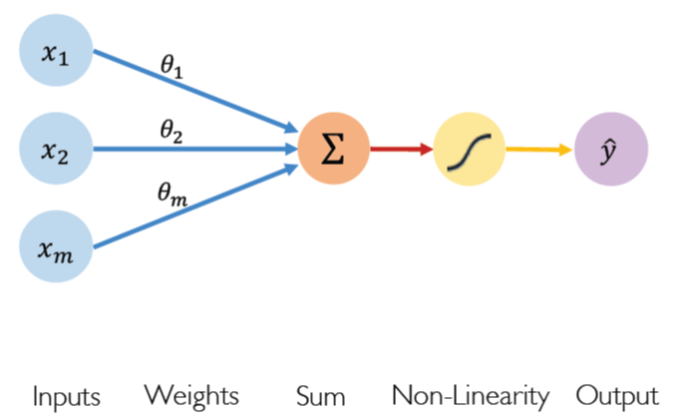
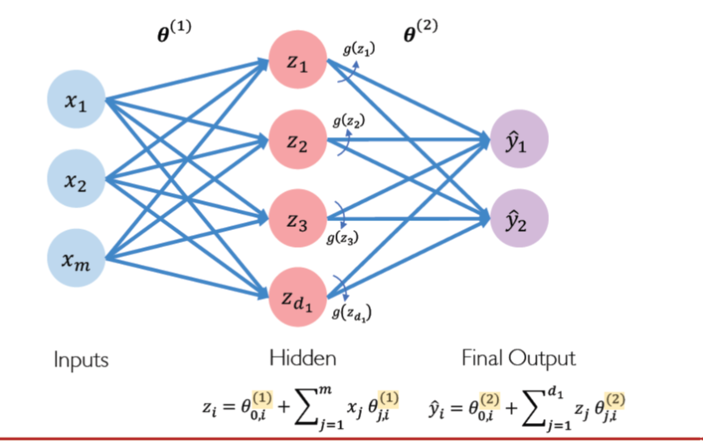

# MIT 6.SI9I - Introduction to Deep Learning
[youtube lesson](https://www.youtube.com/watch?v=JN6H4rQvwgY&t=1828s)

[teaching materials](http://introtodeeplearning.com/)

Teacher: Alexander Amini

**Artificial Intelligence**: Any technique that enables computers to mimic human behavior

**Machine Learning**: Ability to learn without explicitly being programmed

**Deep Learning**: Learn underlying features in data using neural networks

Deep learning is a subset of _Machine Learning_. 

Traditional machine learning algorithms typically define sets of pre-programmed features and the data and they work to extract these features as part of their pipeline. 

Hand engineered features are time consuming, brittle and not scalable in practice. Deep learning try to learn these features directly from data.

**The Perceptron** is the fundamental building block of deep learning. This is just a single neuron in a neural network.

Forward propagation of information, we define a set of inputs from $X_{1}$ to $X_{m}$ on the left and we multiply each of these inputs by their corresponding weight $\Theta_{1}$ tp $\Theta_{m}$. We them sum all these weighted inputs and pass them through a non linear activation function and that produces ou out put $\hat{y}$.

To be more accurate we should add a `bias` to the formula. A bias is a way to our model to learn or we can allow our activation function to shift to the left or right.

We can write this function as follows:

$$\hat{y} = g(\Theta_{0}+ X ^ T \Theta)$$

One very popular activation function is the _sigmoid function_. It takes, any given number on $R$ and transforms to an output between 0 and 1. It is as follows

$$g(z)=\frac{1}{1+e^{-z}}$$

Notice the resemblance to the `logit` function on a logistic regression.

Other options are Hyperbolic Tangent and Rectified Linear Units.

Activation functions are important because they allow to introduce non linearity  our model.

Single layer neural network:

Now we have one hidden layer between our inputs and outputs. If we want to create a deep learning network what we do is to keep stacking these layers and fully connected weights between the layers.

Example problem: Will i pass this class?
Mean squared error loss can be used with regression models that output continuous real numbers. We want to find the network weights that achieve the lowest loss.

Backpropagation for learning model:

$$ \frac{\partial j(\Theta)}{\partial \Theta_{2}} 
= \frac{\partial j(\Theta)}{\partial \hat{y}} 
* \frac{\partial \hat{y}}{\partial \Theta_{2}} $$

The process of back propagation is basically repeat this process to every weight in your network until you compute that gradient $\partial J$

