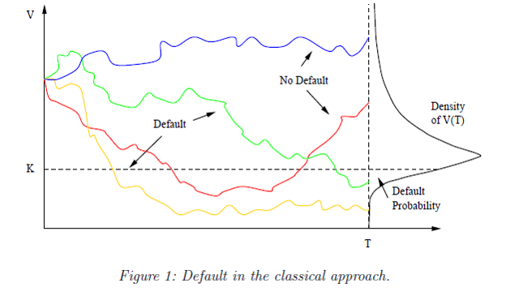
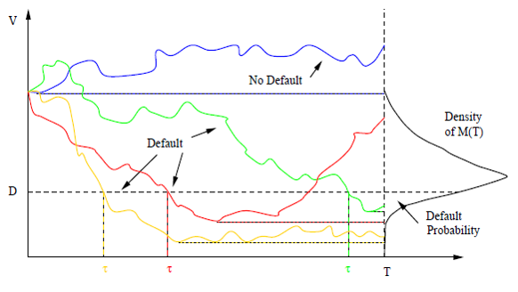

# Credit Risk Modeling and Valuation: an introduction 
[Link to online document](https://papers.ssrn.com/sol3/papers.cfm?abstract_id=479323)

- [Introduction](#introduction)
- [Structural credit models](#structural-credit-models)

## Introduction
This paper defines credit risk as the distribution of financial losses due to unexpected changes in the credit quality of a counterpart in a financial agreement. **Examples range from agency downgrades to failure to service debt to liquidation**.

The distribution of credit losses is complex. At its center is the probability of default, by which we mean any type of failure to honor a financial agreement. To estimate the probability of default, we need to specify:
- a model of investor uncertainty,
- a model of the available information and its evolution over time; and 
- a model definition of the default event.
  
However, default probabilities alone are not sufficient to price credit sensitive securities. We need in addition,
- a model for the risk free interest rate;
- a model of recovery upon default; and
- a model of the premium investors require as compensation for bearing systemic credit risk

There are 3 main quantitative approaches which have been used to measure risk.

1. **Structural approach:** in this approach we make explicit assumptions about the dynamics of a firm's assets, its capital structure, and its debt and share holders. A firm defaults if its assets are insufficient, according to some measure.
2. **Reduced form**: this approach is silent about why a firm defaults. Instead, the dynamics of default are exogenously given through a default rate, or intensity. In this approach, prices of credit sensitive securities can be calculated as if they were default free using an interest rate that is the risk free rate adjusted by the intensity.
3. **Incomplete information**: combines the two approaches.

This paper aim is to summarize the current literature on this approaches.

## Structural credit models
The basis of this models is that corporate liabilities are contingent claims on the assets of a firm. **The market value of the firm is the fundamental source of uncertainty driving credit risk.**

### Classical approach (Merton model)

 **Quote:** Consider a firm with market value $V$, which represents the expected discounted future cash flows of the firm. The firm is financed by equity and zero coupon bond with face value $K$ and maturity date $T$. The firm's contractual obligation is to repay the amount $K$  to the bond investors at time $T$. Debt covenants grant bond investors absolute priority: if the firm cannot fulfill its payment obligation, then bond holders will immediately take over the firm. Hence the default time $\tau$ is a discrete random variable given by:

$$\tau=\begin{cases}
 T \text{ }\text{if}\text{ }  V_{t} < K \\
 \infty\text{ }\text{if}\text{ }\text{else}    
\end{cases}$$

The above quote draws our attention to the following:
- Classical structural credit models only measure the event of default (in this case is default by going concern of the company or a hard default) at maturity time. By simplifying the debt structure to a zero coupon bond, it does not consider the possibility of default on the mean time until $T$ because until that moment there is no claim from the bond holder.
- It present $V$ as the firm value and uses the discounted cash flow model `(DCF)` to describe it. This is a very interesting point given that most papers on structural model present $V$ as the market value or fair value of the firms assets which on its turn are derived from equity valuation. _This doesn't simplifies the model when concerning SME because it is still extremely hard to compute the cash flow capacity of its assets._ **[Main problem: how to do you value a SME?]**
 
 In order to calculate the probability of default we make assumptions about the distribution of assets at debt maturity under the physical probability $P$. The standard model for the evolution of assets prices over time is _Geometric Brownian Motion_:

 $$\frac{dV_{t}}{V_{t}}= \mu dt + \sigma dW_{t} $$

 Where $\mu$ (a natural number) is a drift parameter, $\sigma > 0$ is a volatility parameter, and $W$ is a `standard Brownian motion`[1]. Setting $m=\mu - \frac{1}{2}\sigma^2$, `Ito's lemma`[2] implies that

 $$V_{t}=V_{0}e^{mt+\sigma W_{t}}$$ 

Where $V_{0}$ is the asset value (firms value) in moment 0 and $V_{t}$ in moment or at debts maturity.

It's very important to notice on this picture the situations where there has been a default. Lets take a look into the green and red line of the above graphic. In the green scenario, the asset value has been consistently above the default treshold except at moment $T$. The opposite situation happened on the red scenario. On the classical structural model, default is only evaluated on Debts maturity (which has been simplified to a Zero Coupon Bond with $T$ maturity). This means that the evolution during $T_{0}-T$ is irrelevant.

Since $W_{t}$ is normally distributed with mean zero and variance $T$, default probabilities $p(T)$ are give by

$$p(T)= P[V_{t} < K] =  P[V_{0}e^{mt+\sigma W_{t}}< K] = P[e^{mt+\sigma W_{t}}< \frac{K}{V_{0}}]=P[e^{mt+\sigma W_{t}}< L]$$

$$P[mt+\sigma W_{t}< \log L] =P[\sigma W_{t}< \log L - mt] = \Phi\left(\frac{\log L - mt}{\sigma\sqrt{T}}\right)$$ 

Where $m=\mu - \frac{1}{2}\sigma^2$, $L = \frac{K}{V_{0}}$ is the initial ratio and $\Phi$ is the standard normal distribution function. **This analysis is assuming that the firm can neither repurchase shares nor issue new senior debt.**

If the asset value $V_{t}$ exceeds or equals the face value $K$ of the bonds, the bond holders will receive their promised payment $K$ ad the shareholders will get the remaining $V_{t} - K$. However, if the value of assets $V_{t}$ is less than $K$, the ownership of the firm will be transferred to the bondholders, who lose the amount $K - V_{t}$.

$$B_{T}^T = \min (K, V_{T})= K - \max(0, K - V_{T})$$

This payoff is equivalent to that of a portfolio composed of a default - free loan with face value $K$ maturing at $T$ and a short European put position on the asset of the firm with strike $K$ and maturity $T$. At time $T$ equity value is given by $E_{t}= \max(0,V_{t}-K)$ which is equivalent to the payoff of a European call option on the assets of the firm with strike $K$ and maturity $T$.

When applying the Black Scholes model the following assumptions are made:
- the financial market is frictionless
- trading takes place continuously in time
- risk free interest rates are constant
- firm assets $X$ follow geometric Brownian motion (GBM)
- the value of the firm is a traded asset

The Equity value and Bond Value is as follows applying the Black Scholes Formula:

$$\begin{cases}
    
    E_{0} = V_{0}\Phi(d_{1})-e^{-rT}K\Phi(d_{2})
    \\
    B_{0}^T = V_{0}-V_{0}\Phi(d_{1})+e^{-rT}K\Phi(d_{2})

\end{cases}$$

The value of the put is just equal to the present value of the default loss suffered by bond investors. This is the discount for default risk relative to the riskfree bond, which is value at $K \exp(-rT)$. 

The last expression is very straightforward when the main accounting relation that states that $E = V + K$ is taken in consideration. What is basically saying is that, in the momento 0, the bond value is equal to the company value (Asset value) minus the equity value ($E_{0}$).

 While clearly both equity and debt values depend on the firm's leverage ratio, their sum does not. This result asserts that the market value of the firm is independent of its leverage.[valid only for the classic model]

**Credit Spread:**
The credit spread is the difference between the yield on a defaultable bond and the yield and otherwise equivalent default-free zero bond. It gives the excess return demanded by bond investors to bear the potential default losses. In the context of the Black scholes model the spread is as follows:

$$S(0,T) = -\frac{1}{T}\log\left(\Phi(d_{2})+ \frac{1}{L}e^{rT}\Phi(-d_{1}) \right), T >0$$

Which is a function of maturity $T$, asset volatility $\sigma$, the initial leverage ratio $L$, and riskfree rates $r$.

### First-passage approach (Black & Cox model)
In the classical approach shown above, both statements are true:
- Default only happens on maturity date. If during $t = T - T_{0}$ the asset value falls below the nominal debt value nothing happens,
- firm value can dwindle to almost nothing without triggering default. This is unfavorable to bondholders and most indenture provisions often include safety covenants that give bond investors the right to reorganize a firm if its value falls below a certain barrier.

  

In the Black-Scholes setting with asset following a Brownian motion like $\frac{dV_{t}}{V_{t}}= \mu dt + \sigma dW_{t}$ default probabilities are calculated as follows:

$$p(T) = P[M_{t}<D] = P[\min_{s<t}V_{s} < D]= P[\min_{s<t}(V_{0}e^{ms+\sigma W_{s}}) < D]=$$

$$= P[\min_{s<t}(e^{ms+\sigma W_{s}}) < \frac{D}{V_{0}}]=P[\min_{s<t}(ms+\sigma W_{s}) < \log\left(\frac{D}{V_{0}}\right)]$$

Where $M$ is the historical low of firm values (between now and maturity time $T$).

Since the distribution of the historical low of an arithmetic Brownian motion is inverse Gaussian we have:

$$p(T) = \Phi \left( 
    \frac{\log(D/V_{0})-mT}{\sigma\sqrt{T}}
    \right)+
\left(
     \frac{D}{V_{0}} 
\right)^{\frac{2m}{\sigma^2}} 

\Phi \left( 
    \frac{\log(D/V_{0})+mT}{\sigma\sqrt{T}} 
    \right)$$

When compared to the formula for the probability of default for the classic model we notice that the first element is exactly the same except for the substitution of $L = \frac{K}{V_{0}}$ for $\frac{D}{V_{0}}$ given that now the default treshold is not the debt anymore. The biggest difference is the inclusion of the second element.

Default is now redefined as **firm value falling below the barrier $D < K$ at any time before maturity ($\tau_{1}$) or firm value falling below face value $K$ at maturity ($\tau_{2}$)**. In other words, the default time is defined as the minimum of the first-passage default time and Merton's default time. Even if the firm value does not fall below the barrier $D$, if assets are below the bond's face value at maturity the firm defaults.

In this sense, now the probability of default as to take into consideration 2 limitations:

$$p(T) = 1-P[\min(\tau^1,\tau^2)>T]= 1- P[\min_{t<T}(mt + \sigma W_{t})>\log(\frac{D}{V_{0}}), mT + \sigma W_{T}>\log L] $$

This default probability is obviously higher than the corresponding probability in the classical approach which is obtained as the special case where $D=0$.

$$p(T)=\Phi\left(
    \frac{\log L - mT}{\sigma \sqrt{T}} 
    \right)+ \left( 
        \frac{D}{V_{0}} 
        \right)^\frac{2m}{\sigma^2}
        \Phi\left(
            \frac{\log(\frac{D^2}{KV_{0}})+mT}{\sigma\sqrt{T}}
            \right)$$

The equity position is equivalent to a European down-and-out call option position on firm assets $V$ with strike $K$, barrier $D < K$ and maturity $T$. Unlike in the classical approach, in the first passage approach equity investors do not always benefit  form an increase in asset volatility.

### First passage with time varying default barrier
Another alternative is to introduce a time-varying default barrier $D(t)\eqslantless K$ for all $t<T$.

The equation $D(t) = Ke^{-k(T-t)}$ can be thought of as the face value of the debt, discounted back to time $t$ at a continuously compounding rate $k$

### Excursion approach
The first-passage approach assumes that bond investors immediately take over
control of the firm when its value falls below a barrier whose value is often prescribed by a debt covenant. In practice, bankruptcy codes often grant firms an extended period of time to reorganize operations after a default. If the restructuring is successful, a firm emerges from bankruptcy and continues operating. If the outcome is negative, bond investors seize control and liquidate the remaining firm assets.

 > Note: model to be reviewed latter. Not relevant for the time being 

### Dependent Defaults
Credit spreads of different issuers are correlated through time. Two patterns are found in time series of spreads. The first is that spreads vary smoothly with general macro-economic factors in a correlated fashion. This means that firms share a common dependence on the economic environment, which results in _cyclical correlation_ between defaults. A sudden large variation in the credit risk of one issuer, which causes a spread jump in the first place, can propagate to other issuers as well. The rationale is that economic distress is _contagious_ and propagate from firm to firm.

## Reduced form credit models
Here we assume that default occurs without warning at an exogenous default rate, or intensity. The dynamics of the intensity are specified under the pricing probability. Instead of asking why the firm defaults, the intensity model is calibrated from market prices.

---
**[1]: Brownian motion and stochastic Differential Equations**
In order to understand how the structural models work we have to introduce the concepts of Brownian motion and Stochastic differential equations.However, before the geometric Brownian motion is considered, it is necessary to discuss the concept of a Stochastic Differential Equation (SDE). This will allow us to formulate the GBM and solve it to obtain a function for the asset price path.

A **stochastic differential equation (SDE)** is a _differential equation_ in which one or more of the terms is a _stochastic process_, resulting in a solution which is also a stochastic process. Typically, SDEs contain a variable which represents random white noise calculated as the derivative of Brownian motion or the Wiener process.

A _differential equation_ is a mathematical equation that relates some function with its derivatives. In applications, the functions usually represent physical quantities, the derivatives represent their rates of change, and the equation defines a relationship between the two.

In probability theory and related fields, a _stochastic or random process_ is a mathematical object usually defined as a collection of random variables. 

An SDE can be represented as follows:

$$dX_{t}=\mu(X_{t},t)dt+\sigma(X_{t},t)dB_{t} \Rightarrow X_{t-s} - X_{t}=\int_{t}^{t+s}\mu(X_{u},u)du + \int_{t}^{t+s}\sigma(X_{u},u)dB_{u} $$

Where $B$ denotes a Wiener process (standard Brownian motion).
> A heuristic (but very helpful) interpretation of the stochastic differential equation is that in a small time interval of length δ the stochastic process Xt changes its value by an amount that is **normally distributed** with expectation μ(Xt, t) δ and variance σ(Xt, t)² δ and is independent of the past behavior of the process. **The function μ is referred to as the drift coefficient, while σ is called the diffusion coefficient. The stochastic process Xt is called a diffusion process, and satisfies the Markov property**.

[Wikipedia SDE](https://en.wikipedia.org/wiki/Stochastic_differential_equation)

A **geometric Brownian motion (GBM)** (also known as exponential Brownian motion) is a continuous-time stochastic process in which the logarithm of the randomly varying quantity follows a Brownian motion (also called a Wiener process) with drift. It is an important example of stochastic processes satisfying a stochastic differential equation (SDE); in particular, it is used in mathematical finance to model stock prices in the _Black–Scholes_ model.

A stochastic process $S_{t}$ is said to follow a GBM if it satisfies the following stochastic differential equation (SDE)

$$dS_{t}= \mu S_{t}dt+\sigma S_{t}dW_{t}$$

Where $W_{t}$ is a Wiener process or Brownian motion and $\mu$ the percentage drift and $\sigma$ the percentage volatility are constants. **The former is used to model deterministic trends, while the latter term is often used to model a set of unpredictable events occurring during this motion.** If the mean of any increment is zero, then the resulting Wiener or Brownian motion process is said to **have zero drift**.  **If the mean of the increment for any two points in time is equal to the time difference multiplied by some constant $\mu$ , which is a real number, then the resulting stochastic process is said to have drift $\mu$** 

Markov processes are stochastic processes, traditionally in discrete or continuous time, that have the Markov property, which means the next value of the Markov process depends on the current value, but it is conditionally independent of the previous values of the stochastic process. In other words, the behavior of the process in the future is stochastically independent of its behavior in the past, given the current state of the process. **The Brownian motion process and the Poisson process (in one dimension) are both examples of Markov processes in continuous time.**

[Wikipedia GBM](https://en.wikipedia.org/wiki/Geometric_Brownian_motion)

[Wikipedia Stochastic process](https://en.wikipedia.org/wiki/Stochastic_process)

**[2]: Ito's lemma**

In mathematics, Itô's lemma is an identity used in Itô calculus to find the differential of a time-dependent function of a stochastic process. It serves as the stochastic calculus counterpart of the chain rule. It can be heuristically derived by forming the Taylor series expansion of the function up to its second derivatives and retaining terms up to first order in the time increment and second order in the Wiener process increment. The lemma is widely employed in mathematical finance, and its best known application is in the derivation of the Black–Scholes equation for option values.

[Wikipedia Ito's Lemma](https://en.wikipedia.org/wiki/It%C3%B4%27s_lemma)