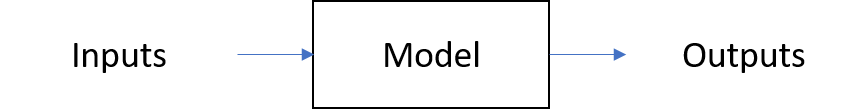

# Statistical Modeling in R (part 1)
## Chapter 1 - Introduction

Statistical modeling is used for:
- Identifying patterns in data~
- Classifying events
- Untangling multiple influences
- Assessing strenght of evidence 

A model is a "a representation for a purpose". A statistical model is:
- A special type of mathematical model
- informed by data
- incorporates uncertainty and randomness

The most importan bloks for this models using R, are:
1. Function
2. dataframes
3. formulass

> **Notes**: In R, columns are variables and rows are cases os observations.s

To access data contained in a R package you have a few options

1. Use the `data()` function
2. Refer to the package using double - colomn notation
3. Load the package, then refer to the dataset by name.

:heavy_exclamation_mark: 
The `mosaic package` augments simple statistical functions such as `mean()`, `sd()`, `median()`, etc so that they can be used with formulas. For instance the following code.


 
 ```R
 mosaic::mean(wage ~ sex, data = CPS85)
 ```

will calculate the mean wage for each sex. In contrast, the *builtin* mean()

## Chapter 2 - Designing, training and evaluation models

Creating a model is a process. You start with an idea and design a model based on it. You use data to both train and evaluate the model results and design the next steps based on this information.

Steps on creating models:
1. A suitable training data set
2. Specify response and explanatory variables
3. Select a model architecture (_eg: linear regression, probit, recursive partitioning (rpart), etc)_
4. Training a model: automatic process carried out by the computer [_"fits the model to the data"_]
 
### About variables...
We can only have one response variable per model but multiplous explanatory variables.

The following functions will be used to train models during this course:


~~~R
# lm()  for linear models
lm(wage ~ educ + exper, data = CPS85) 

# rpart() for recursive partitoning
rpart(wage ~ edu + exper, data = CPS85)

# Note that the inputs in both cases are the same with a formula (~) and a dataframe
~~~

~~~R
# The following code snippet trains a linear model based on a given database [Runners] 
# & plots the results
handicap_model_3 <- lm(net ~ age + sex, data = Runners)
fmodel(handicap_model_3)
~~~

**Using the recursive partitioning**
There are many architectures that can be used to train a model. In this course the recursive partitioning will be used together with the linear model. 

The recursive partitoning architectures has a parameter, `cp`, that allows you to dial up or down the complexity of the model being built. [issue addressed during the credit risk model course]

```R
# The syntax is identical to the one used for linear models:
rpart(net ~ sex + age, data=Runners , cp = 0.002 )
```

In the recursive partitioning architecture, the model functions have 'steps'. 

### New model for a new purpose
Now, let's imagine another possible purpose for a model: **to predict whether or not a person who participated in the race this year will participate next year**.

Predicting whether or not a person will run again next year is a very different purpose than finding a typical running time. For this task the dataframe has changed and now includs only includs observations of people who have run twice during the year. They included a new variable `runs_again` that represents if the person(observation) participated next year (3 years).

<span style="color:blue">
<b>Note:</b> As a comparisson to the credit risk model i believe that they are analysing the last year of the run in order to predict the year after (like the current year)
</span>.

1. The output of the model will be either TRUE or FALSE 
2. The response variable `runs_again` is categorical, not numerical. Since `lm()` is intended for quantitative responses, you'll use only rpart architecture which works well for both numerical and categorical responses.

The following code example creates a rpart model and the output is a plot which showcases the probability of running depending of the age depending on the net run time. 

```R
# Create run_again_model
run_again_model <- rpart(runs_again ~ age + sex + net, cp = 0.005, data= Ran_twice)

# Visualize the model (don't change)
fmodel(run_again_model, ~ age + net, data = Ran_twice)
```

### Evaluating models
The model we choose impacts the conclusions.
In a nutshell models work like this:



Provide inputs for explanatory variables & calculate the corresponding output.
